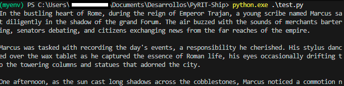

# 🧪 OpenAI API Setup 

This section helps you create and validate OpenAI account & credentials, that will be use to connect PyRIT Ship with OpenAI models.  
Follow these steps in order.

---

## 1️⃣ Create Your OpenAI Account & API Key
1. Go to [platform.openai.com](https://platform.openai.com)  
2. Sign in and visit **API Keys**  
3. Click **“Create new secret key”**  
4. Save the key in a `.env` file:

```env
OPENAI_GPT35_API_KEY=sk-xxxxxxxxxxxxxxxxxxxxxxxxxxxxxxxxxxxxxxxx
OPENAI_GPT35_ENDPOINT="https://api.openai.com/v1"
OPENAI_GPT35_MODEL_NAME=gpt-3.5-turbo
```

---

## 2️⃣ Install Required Python Packages
Run this in your terminal:

```bash
pip install openai python-dotenv
pip install pyrit # for PyRIT connectors
```

---

## 3️⃣ Test Your Credentials

Create a simple script (`test_openai.py`) to confirm everything works:

```python
import os
from openai import OpenAI
from dotenv import load_dotenv

# Load .env variables
load_dotenv()

client = OpenAI(api_key=os.getenv("OPENAI_API_KEY"))

response = client.responses.create(
    model="gpt-4o",
    input="Write a short story about the Roman Empire.",
    max_output_tokens=200,
    temperature=0.7,
)

print(response.output_text)
```

👉 If you see a short story printed, your setup is correct!




### A. Raw API OpenAI Test Script

To verify the raw API connection, use this updated test script:


```Python
import os
from openai import OpenAI
from dotenv import load_dotenv

load_dotenv()

# Initialize the standard OpenAI client
client = OpenAI(api_key=os.getenv("OPENAI_GPT4O_CHAT_KEY"))

try:
    response = client.chat.completions.create(
        model=os.getenv("OPENAI_GPT4O_CHAT_MODEL", "gpt-4o"),
        messages=[{"role": "user", "content": "Write a short story about the Roman Empire."}],
        max_tokens=200,
        temperature=0.7,
    )
    print(f"Success! Response:\n{response.choices[0].message.content}")
except Exception as e:
    print(f"Connection Failed: {e}")

```

### B. The Target Initializer

Use this function in your PyRIT server to safely create the connection target:


```Python
import os
from pyrit.common import initialize_pyrit, IN_MEMORY
from pyrit.prompt_target import OpenAIChatTarget

def initialize_openai_target():
    # MANDATORY: Initialize PyRIT memory before creating a target 
    initialize_pyrit(memory_db_type=IN_MEMORY)

    return OpenAIChatTarget(
        model_name=os.environ.get("OPENAI_GPT4O_CHAT_MODEL"),
        endpoint=os.environ.get("OPENAI_GPT4O_CHAT_ENDPOINT"),
        api_key=os.environ.get("OPENAI_GPT4O_CHAT_KEY")
    )

```


---

## 🔍 Tips
- Keep your `.env` file private — never share your API key.  
- Track usage at [OpenAI Usage Dashboard](https://platform.openai.com/usage).  
- If you hit errors (quota, rate limits), check credits or switch to `gpt-3.5-turbo`.  

-   **System Messages:** Use the `system` role to define the AI's "persona" (e.g., "You are a professional security auditor") for more consistent results.
    
-   **Async Workflows:** In your Flask app, always use `asyncio.run()` when calling PyRIT methods like `send_prompts_async` to ensure the server remains responsive.
    
-   **Token Limits:** Track your usage at the [OpenAI Dashboard](https://platform.openai.com/usage) to avoid 429 "Rate Limit" errors during testing.
    

👉 **Note:** If you encounter a `401 Unauthorized` error, double-check that your `OPENAI_GPT4O_CHAT_KEY` starts with `sk-` and does not contain extra spaces.