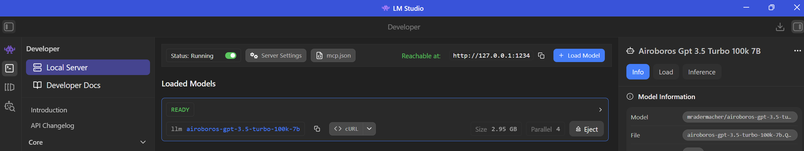

# 🏠 Local LLM Setup (Quick Guide)

This section helps you set up a private, local AI environment using **LM Studio**. This allows you to run models like Llama or Mistral on your own hardware without an internet connection or per-token costs.

---

## 1️⃣ Install & Start LM Studio Server

1. **Download:** Get LM Studio from [lmstudio.ai](https://lmstudio.ai/) for Windows, macOS, or Linux.
2. **Download a Model:** Use the **Discover** tab to find a model (e.g., `airoboros-gpt-3.5-turbo-100k-7b`) and click **Download**.
3. **Start the Server:**
* Click the **Local Server** (double-arrow icon) on the left sidebar.
* Select your downloaded model from the dropdown at the top and click **Load Model**.
* Click **Start Server**. By default, it runs at `http://localhost:1234`.



### LLM Comparative Table for PyRIT Framework

| Model Name | LM Studio Search Term | PyRIT Role | English/LLM Focus | Censorship Level |
|------------|----------------------|------------|-------------------|------------------|
| DeepSeek-R1 (8B) | `DeepSeek-R1-Distill-Llama-8B` | Orchestrator: High-level strategy & reasoning. | Advanced logic & analytical English. | Medium (Resistant but can be bypassed) |
| Dolphin Llama 3 | `Dolphin-2.9-Llama-3-8B` | Attacker: Generating harmful/explicit content. | Creative & conversational English. | None (Uncensored) |
| Phi-4 (3.8B) | `Phi-4-GGUF` | Scorer: Evaluating if a target was breached. | High-precision technical English. | High (Microsoft Safety) |
| Mistral Nemo | `Mistral-Nemo-12B-v1` | Payload: Attacking long context docs/PDFs. | Professional & nuanced English. | Low-Medium |
| GPT-4o | (Cloud API Only) | Golden Standard: Baseline for all attacks. | Native-level versatility. | Very High (RLHF) |
| GPT-3.5 Turbo | (Cloud API Only) | Fast Target: Good for testing basic injections. | Reliable instruction following. | High (RLHF) |


---

## 2️⃣ Configure Your Environment

Add your local settings to your `.env` file to match the connection logic used in your project:

```env
# Local LM Studio Configuration
LOCAL_GPT35turbo_CHAT_MODEL="lmstudio-community/Meta-Llama-3-8B-Instruct-GGUF"
LOCAL_GPT35turbo_CHAT_ENDPOINT="http://localhost:1234/v1"
LOCAL_GPT35turbo_CHAT_KEY="not-needed"

```

* **Note:** The `LOCAL_GPT35turbo_CHAT_MODEL` must exactly match the **API Identifier** shown in the LM Studio server tab.
* **Important:** Always ensure your endpoint ends with `/v1` for the OpenAI SDK to work correctly.

---

## 3️⃣ Test Your Local Connection

Use this script (`test_local.py`) to verify your connection and run your first prompt. This version includes the mandatory **PyRIT memory initialization** required by your code.

```python
import os
import asyncio
from dotenv import load_dotenv
from openai import OpenAI
from pyrit.common import initialize_pyrit, IN_MEMORY
from pyrit.prompt_target import OpenAIChatTarget

# Load variables
load_dotenv()

# 1. Initialize PyRIT Memory (Crucial for OpenAIChatTarget)
initialize_pyrit(memory_db_type=IN_MEMORY)

async def main():
    # 2. Setup the Local Target
    local_target = OpenAIChatTarget(
        model_name=os.getenv("LOCAL_GPT35turbo_CHAT_MODEL"),
        endpoint=os.getenv("LOCAL_GPT35turbo_CHAT_ENDPOINT"),
        api_key=os.getenv("LOCAL_GPT35turbo_CHAT_KEY")
    )

    # 3. Run the standard test prompt
    prompt = "Write a short story about the Roman Empire."
    print(f"--- Sending to Local LLM: {local_target._model_name} ---")
    
    response = await local_target.send_prompt_async(prompt=prompt)
    print(f"\nResponse:\n{response}")

if __name__ == "__main__":
    asyncio.run(main())

```

---

## ⚠️ Troubleshooting Common Local Errors

* **401 Unauthorized:** Even if your local server doesn't need a key, the OpenAI SDK might fail if the `api_key` field is completely empty. Always provide a dummy string like `"lm-studio"`.
* **Connection Refused:** Ensure the LM Studio server is actually "Started" and you are using the correct port (`1234` by default).
* **Memory Error:** If you get `ValueError: Central memory instance has not been set`, ensure you called `initialize_pyrit()` before creating any targets.

This guide follows the same principles as the OpenAI SDK but adapts the endpoint to your local hardware. For more details on using different local providers like Ollama, check out this video:

[Setup Local LLM for Python and OpenAI Library](https://www.youtube.com/watch?v=SUeIsSML2UY)

This tutorial demonstrates how to use LM Studio as a local inference server and integrate it with your Python applications using the OpenAI-compatible API.

### Technical Notes for your ASUS Zephyrus M16 (English)

-   **VRAM Management (4GB RTX 3050 Ti):** * **Quantization is Mandatory:** To avoid "Out of Memory" (OOM) errors, always download the **GGUF** format. Specifically, choose versions labeled as **Q4_K_M** or **Q4_0**. These use approximately 5GB to 6GB of total system RAM, allowing your GPU to handle the processing without crashing.
    
    -   **Hardware Acceleration:** In LM Studio, ensure "GPU Offload" is set to "Max". This ensures PyRIT requests are processed by your NVIDIA cores rather than your CPU.
        
-   **PyRIT Integration Tips:**
    
    -   **OpenAI Compatibility:** LM Studio mimics the OpenAI API structure. In your Python code, use the `OpenAIChatTarget` class.
        
    -   **Endpoint Configuration:** Your local address will usually be `http://localhost:1234/v1`.
        
    -   **Uncensored Advantage:** When performing Red Teaming, a "Censored" model (like Phi-4 or GPT-4o) will often refuse to generate an attack prompt. **Dolphin Llama 3** is your best bet for the "Attacker" role because it lacks these ethical guardrails, allowing PyRIT to complete its automation cycles.
        
-   **Model Switching:**
    
    -   Since you have limited VRAM, you cannot run two 8B models simultaneously at full speed.
        
    -   **Strategy:** Load the "Attacker" model in LM Studio, generate the prompts via PyRIT, then swap the model in LM Studio to the "Target" model to test the response.