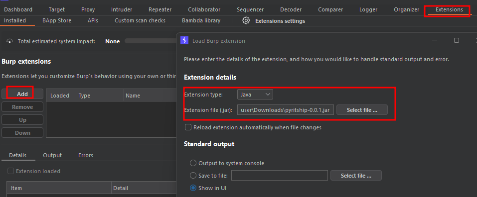
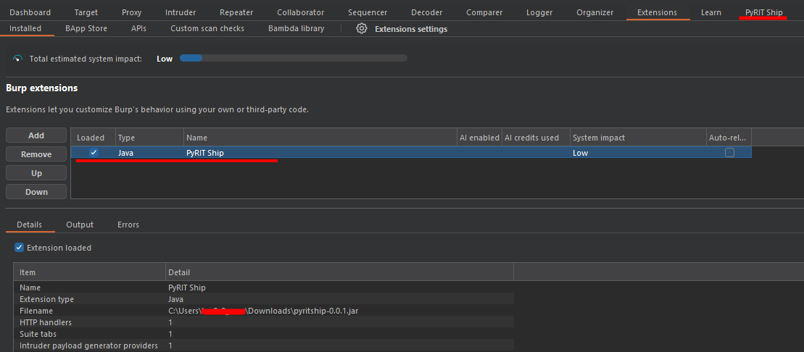

# ⚙️ PyritShip – Burp Extension Configuration Guide

Once you’ve built the `.jar` file [pyritship-0.0.1.jar](pyritship-0.0.1.jar), follow these steps to install and configure it in **Burp Suite**:

---

## 🔌 Install the Extension

1. **Open Burp Suite**  
   - Launch Burp Suite (Community or Professional edition).  
   - Ensure you’re running a compatible version (tested with Burp Suite v2023.12+).  

2. **Navigate to the Extender Tab**  
   - In the top menu, click **Extender**.  
   - Select the **Extensions** sub-tab.  

3. **Add the Extension**  
   - Click **Add**.  
   - Set **Extension type** → `Java`.  
   - Browse and select the `.jar` file:  
     ```
     PyRIT-Ship\burp_extension\pyritship\build\libs\pyritship-0.0.1.jar
     ```

     


4. **Confirm Installation**  
   - Burp will load the extension.  
   - Check the **Output** tab for logs confirming successful load.  
   - You should see messages like:  
     ```
     Loaded extension: pyritship-0.0.1.jar
     ```

---

## 🧪 Verify the Extension

- Go to the **Extender → Extensions** list.  
- Ensure `pyritship` appears with **Status: Loaded**.  
- If errors occur:
  - Check that **Java JDK 21** is installed and correctly set in PATH.  
  - Verify the `.jar` file was built successfully (no corrupted build).  
  - Use the **Gradle wrapper** (`gradlew.bat`) to rebuild if needed.  




---

## ⚡ Optional Configuration

- **Enable/Disable Extension**: You can toggle the extension in the Extensions list.  
- **Logging**: Use the **Output** tab to monitor runtime logs for debugging.  
- **Dependencies**: If the extension requires external libraries, ensure they are bundled in the `.jar` or available in Burp’s classpath.  

---

## 📝 Notes & Best Practices

- Always test the extension in a **separate Burp project** before using it in production engagements.  
- Keep backups of working `.jar` builds.  
- If Burp crashes or fails to load, try clearing old extensions and re-adding only `pyritship`.  
- For reproducibility, document the exact Burp Suite version and Java/Gradle versions used.  

